# AI Smart Expense Tracker — Database Schema & Data Models

This document specifies the MongoDB database architecture, Mongoose schemas, data validation rules, relationships, and indexing strategies for the **AI Smart Expense Tracker**.

---

## 1. Entity-Relationship (ER) Diagram

```mermaid
erDiagram
    User ||--o{ Expense : "records"
    User ||--o{ Income : "records"
    User ||--o{ Budget : "configures"
    User ||--o{ SavingsGoal : "tracks"
    User ||--o{ ImportHistory : "uploads"
    Category ||--o{ Expense : "classifies"
    Category ||--o{ Budget : "defines"

    User {
        ObjectId _id PK
        string name "required, trim"
        string email UK "required, unique, lowercase"
        string password "required, hashed bcrypt"
        string role "enum: ['user', 'admin'], default: 'user'"
        string status "enum: ['active', 'deactivated', 'banned']"
        string currency "default: 'INR'"
        date createdAt
        date updatedAt
    }

    Expense {
        ObjectId _id PK
        ObjectId userId FK "indexed, ref: User"
        string title "required, trim"
        number amount "required, min: 0.01"
        string category "required, ref: Category.name"
        string description "optional"
        string merchant "indexed, normalized name"
        string paymentMethod "enum: ['UPI', 'Credit Card', 'Debit Card', 'Cash', 'Net Banking', 'Other']"
        date date "required, indexed"
        object sourceFile "{ fileName, fileType, importId }"
        boolean isImported "default: false"
        date createdAt
        date updatedAt
    }

    Income {
        ObjectId _id PK
        ObjectId userId FK "indexed, ref: User"
        string source "required, e.g. Salary, Freelance"
        number amount "required, min: 0.01"
        string description "optional"
        date date "required, indexed"
        object sourceFile "{ fileName, fileType, importId }"
        boolean isImported "default: false"
        date createdAt
        date updatedAt
    }

    Budget {
        ObjectId _id PK
        ObjectId userId FK "indexed, ref: User"
        string category "required, ref: Category.name"
        number amount "required, monthly limit"
        number month "1 - 12"
        number year "e.g. 2026"
        date createdAt
        date updatedAt
    }

    SavingsGoal {
        ObjectId _id PK
        ObjectId userId FK "indexed, ref: User"
        string title "required"
        number targetAmount "required, min: 1"
        number currentAmount "default: 0"
        date deadline "optional"
        string description "optional"
        string status "enum: ['in_progress', 'completed', 'paused']"
        date createdAt
        date updatedAt
    }

    Category {
        ObjectId _id PK
        string name UK "required, unique"
        string type "enum: ['expense', 'income', 'both']"
        string color "hex code e.g. #F59E0B"
        string icon "icon identifier"
        boolean isDefault "default: true"
        ObjectId createdBy FK "ref: User (null if system default)"
        date createdAt
    }

    ImportHistory {
        ObjectId _id PK
        ObjectId userId FK "indexed, ref: User"
        string fileName "required"
        string fileType "enum: ['pdf', 'xlsx', 'xls', 'csv', 'txt', 'json']"
        number fileSize "bytes"
        number transactionCount "default: 0"
        number duplicatesDetected "default: 0"
        string status "enum: ['pending', 'completed', 'failed', 'partial']"
        object metadata "parsing duration, confidence avg"
        date importedAt "default: Date.now"
    }
```



---

## 2. Detailed Schema Specifications

### 2.1 User Model (`User.js`)
```javascript
const userSchema = new mongoose.Schema({
  name: {
    type: String,
    required: [true, 'Name is required'],
    trim: true,
    maxlength: 100
  },
  email: {
    type: String,
    required: [true, 'Email is required'],
    unique: true,
    lowercase: true,
    trim: true,
    match: [/^\S+@\S+\.\S+$/, 'Please enter a valid email address']
  },
  password: {
    type: String,
    required: [true, 'Password is required'],
    minlength: [6, 'Password must be at least 6 characters']
  },
  role: {
    type: String,
    enum: ['user', 'admin'],
    default: 'user'
  },
  status: {
    type: String,
    enum: ['active', 'deactivated', 'banned'],
    default: 'active'
  },
  currency: {
    type: String,
    default: 'INR'
  }
}, {
  timestamps: true
});

// Indexes
userSchema.index({ email: 1 });
userSchema.index({ role: 1, status: 1 });
```

### 2.2 Expense Model (`Expense.js`)
```javascript
const expenseSchema = new mongoose.Schema({
  userId: {
    type: mongoose.Schema.Types.ObjectId,
    ref: 'User',
    required: true,
    index: true
  },
  title: {
    type: String,
    required: [true, 'Expense title is required'],
    trim: true,
    maxlength: 150
  },
  amount: {
    type: Number,
    required: [true, 'Amount is required'],
    min: [0.01, 'Amount must be greater than 0']
  },
  category: {
    type: String,
    required: [true, 'Category is required'],
    trim: true,
    default: 'Other'
  },
  description: {
    type: String,
    trim: true,
    maxlength: 500
  },
  merchant: {
    type: String,
    trim: true,
    default: 'Unknown Merchant'
  },
  paymentMethod: {
    type: String,
    enum: ['UPI', 'Credit Card', 'Debit Card', 'Cash', 'Net Banking', 'Other'],
    default: 'Other'
  },
  date: {
    type: Date,
    required: [true, 'Transaction date is required'],
    default: Date.now
  },
  sourceFile: {
    fileName: { type: String, default: null },
    fileType: { type: String, default: null },
    importId: { type: mongoose.Schema.Types.ObjectId, ref: 'ImportHistory', default: null }
  },
  isImported: {
    type: Boolean,
    default: false
  },
  aiCategorized: {
    type: Boolean,
    default: false
  },
  aiConfidence: {
    type: Number,
    min: 0,
    max: 1,
    default: null
  }
}, {
  timestamps: true
});

// Strategic Performance & Duplicate-Detection Indexes
expenseSchema.index({ userId: 1, date: -1 });
expenseSchema.index({ userId: 1, category: 1 });
expenseSchema.index({ userId: 1, date: 1, amount: 1, merchant: 1 });
```

### 2.3 Income Model (`Income.js`)
```javascript
const incomeSchema = new mongoose.Schema({
  userId: {
    type: mongoose.Schema.Types.ObjectId,
    ref: 'User',
    required: true,
    index: true
  },
  source: {
    type: String,
    required: [true, 'Income source is required'],
    trim: true,
    maxlength: 150
  },
  amount: {
    type: Number,
    required: [true, 'Amount is required'],
    min: [0.01, 'Amount must be greater than 0']
  },
  description: {
    type: String,
    trim: true,
    maxlength: 500
  },
  date: {
    type: Date,
    required: [true, 'Income date is required'],
    default: Date.now
  },
  sourceFile: {
    fileName: { type: String, default: null },
    fileType: { type: String, default: null },
    importId: { type: mongoose.Schema.Types.ObjectId, ref: 'ImportHistory', default: null }
  },
  isImported: {
    type: Boolean,
    default: false
  }
}, {
  timestamps: true
});

incomeSchema.index({ userId: 1, date: -1 });
```

### 2.4 Budget Model (`Budget.js`)
```javascript
const budgetSchema = new mongoose.Schema({
  userId: {
    type: mongoose.Schema.Types.ObjectId,
    ref: 'User',
    required: true,
    index: true
  },
  category: {
    type: String,
    required: true,
    trim: true
  },
  amount: {
    type: Number,
    required: [true, 'Budget amount is required'],
    min: [1, 'Budget must be at least ₹1']
  },
  month: {
    type: Number,
    required: true,
    min: 1,
    max: 12
  },
  year: {
    type: Number,
    required: true,
    min: 2020,
    max: 2099
  }
}, {
  timestamps: true
});

// Compound unique index prevents duplicate budgets for same category in the same month
budgetSchema.index({ userId: 1, category: 1, month: 1, year: 1 }, { unique: true });
```

### 2.5 SavingsGoal Model (`SavingsGoal.js`)
```javascript
const savingsGoalSchema = new mongoose.Schema({
  userId: {
    type: mongoose.Schema.Types.ObjectId,
    ref: 'User',
    required: true,
    index: true
  },
  title: {
    type: String,
    required: [true, 'Savings goal title is required'],
    trim: true,
    maxlength: 150
  },
  targetAmount: {
    type: Number,
    required: [true, 'Target amount is required'],
    min: [1, 'Target amount must be greater than 0']
  },
  currentAmount: {
    type: Number,
    default: 0,
    min: [0, 'Current amount cannot be negative']
  },
  deadline: {
    type: Date,
    default: null
  },
  description: {
    type: String,
    trim: true,
    maxlength: 500
  },
  status: {
    type: String,
    enum: ['in_progress', 'completed', 'paused'],
    default: 'in_progress'
  }
}, {
  timestamps: true
});

savingsGoalSchema.index({ userId: 1, status: 1 });
```

### 2.6 Category Model (`Category.js`)
```javascript
const categorySchema = new mongoose.Schema({
  name: {
    type: String,
    required: [true, 'Category name is required'],
    trim: true,
    unique: true
  },
  type: {
    type: String,
    enum: ['expense', 'income', 'both'],
    default: 'expense'
  },
  color: {
    type: String,
    default: '#6B7280'
  },
  icon: {
    type: String,
    default: 'tag'
  },
  isDefault: {
    type: Boolean,
    default: true
  },
  createdBy: {
    type: mongoose.Schema.Types.ObjectId,
    ref: 'User',
    default: null // null indicates system-wide default
  }
}, {
  timestamps: true
});
```

### 2.7 ImportHistory Model (`ImportHistory.js`)
```javascript
const importHistorySchema = new mongoose.Schema({
  userId: {
    type: mongoose.Schema.Types.ObjectId,
    ref: 'User',
    required: true,
    index: true
  },
  fileName: {
    type: String,
    required: true
  },
  fileType: {
    type: String,
    enum: ['pdf', 'xlsx', 'xls', 'csv', 'txt', 'json'],
    required: true
  },
  fileSize: {
    type: Number, // In bytes
    required: true
  },
  transactionCount: {
    type: Number,
    default: 0
  },
  duplicatesDetected: {
    type: Number,
    default: 0
  },
  status: {
    type: String,
    enum: ['pending', 'completed', 'failed', 'partial'],
    default: 'completed'
  },
  metadata: {
    type: mongoose.Schema.Types.Mixed,
    default: {}
  },
  importedAt: {
    type: Date,
    default: Date.now
  }
}, {
  timestamps: true
});

importHistorySchema.index({ userId: 1, importedAt: -1 });
```

---

## 3. Duplicate Detection Strategy

To prevent accidental re-importing of identical bank statements, the duplicate engine runs before staging transactions:

```javascript
// Query template for duplicate detection:
const isDuplicate = await Expense.exists({
  userId,
  amount: candidate.amount,
  // Match date within +/- 24 hours window to accommodate timezone drift across banks
  date: {
    $gte: new Date(new Date(candidate.date).getTime() - 24 * 60 * 60 * 1000),
    $lte: new Date(new Date(candidate.date).getTime() + 24 * 60 * 60 * 1000)
  },
  merchant: new RegExp(`^${candidate.merchant.trim()}$`, 'i')
});
```
Candidate transactions matching this criteria will be flagged in the staging table with `isDuplicate: true` and will require explicit user override.
